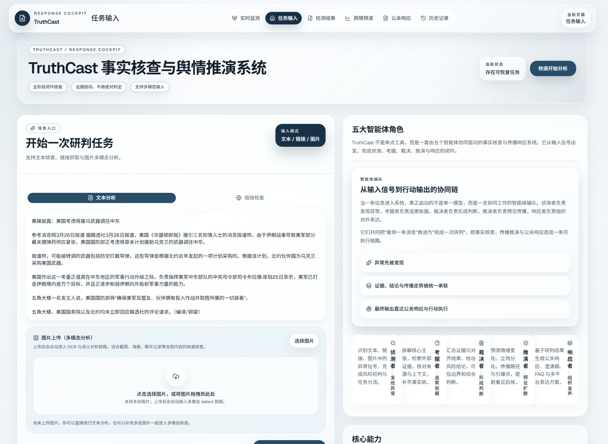
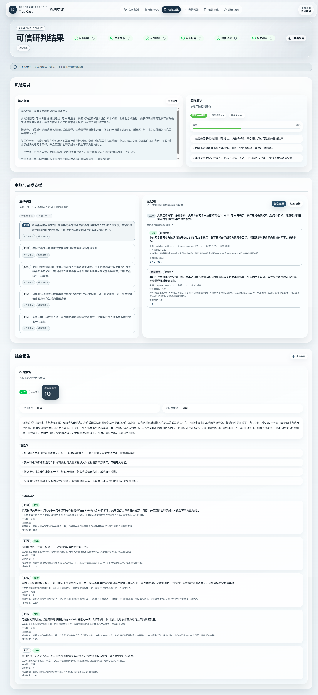
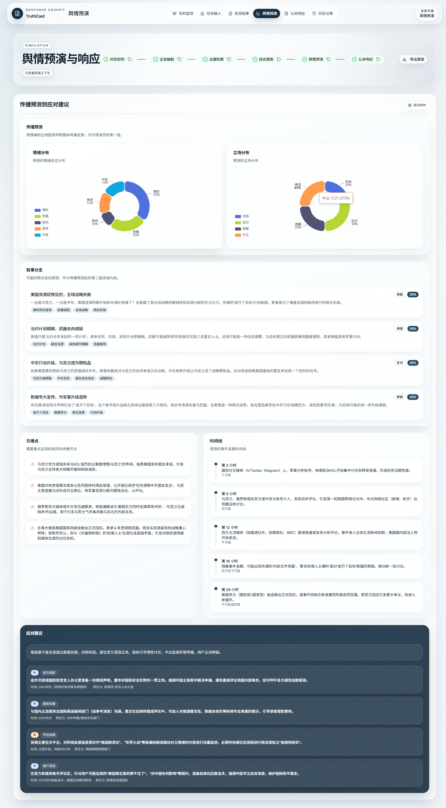
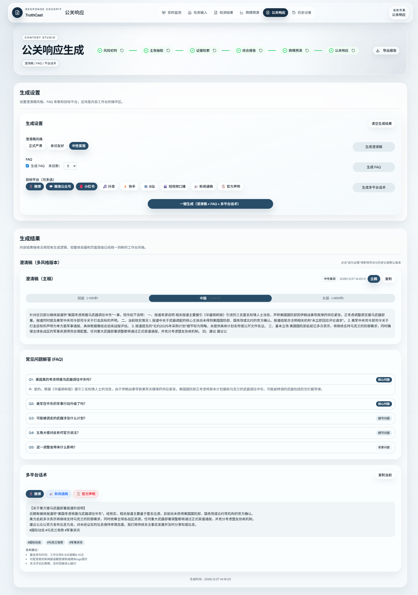
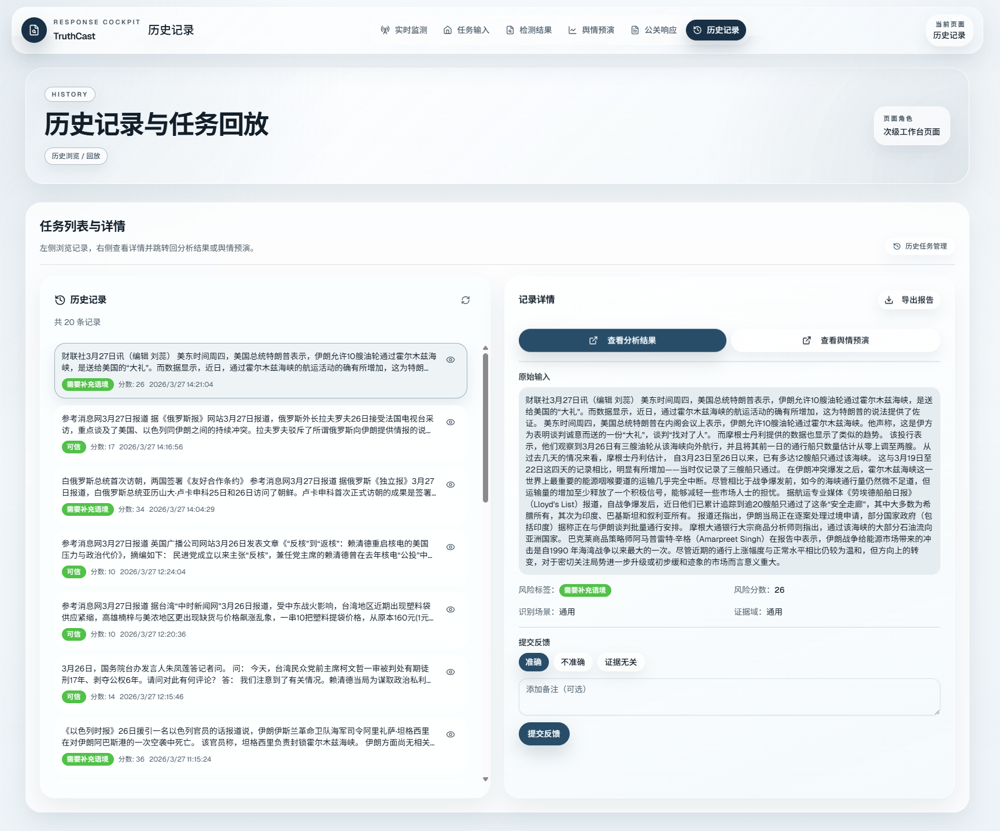

# TruthCast (明察) - 全链路事实核查与舆情推演系统

**TruthCast (明察)** 是一个集成了**虚假新闻检测**与**舆情预演**的智能体系统。它通过大语言模型（LLM）与规则引擎的深度结合，实现从文本风险初筛、核心主张抽取、多引擎联网检索、证据聚合对齐，到最终生成综合核查报告与舆情演化预测的全链路自动化分析。

## 🌟 核心特性

- **🤖 Agent 自主策略**: 动态感知文本复杂度以决定主张抽取数量，基于风险分数动态调整证据检索深度，LLM 自主决定证据聚合策略。
- **🔍 深度事实核查**:
  - **风险快照**: 快速评估文本可信度与潜在风险。
  - **主张抽取**: 将复杂长文本拆解为原子化、可核查的核心主张。
  - **混合检索**: 支持 Bocha（博查）、SearXNG、Tavily、SerpAPI 等多引擎联网检索。
  - **证据聚合与对齐**: LLM 驱动的证据归纳，逐条主张与证据进行立场对齐（支持/反对/证据不足）并给出置信度。
- **📈 舆情演化预演**:
  - **四阶段预测**: 情绪与立场分析 → 叙事分支生成 → 引爆点识别 → 应对建议生成。
  - **流式输出**: 支持 SSE (Server-Sent Events) 流式返回预演结果，提升前端响应体验。
- **📝 应对内容生成**:
  - 支持生成 **澄清稿（短/中/长）**、**FAQ**、以及 **多平台话术**（微博/微信公众号/小红书/抖音/快手/B站/短视频口播/新闻通稿/官方声明）。
  - 支持澄清稿 **多风格多版本并存**，并可设置“主稿”（影响导出与历史默认版本）。
- **🛡️ 高可用与稳定性**:
  - **规则兜底**: 所有 LLM 节点（抽取、对齐、预演等）均配备规则回退机制，确保在 LLM 失败或超时时系统依然可用。
  - **JSON 自动修复**: 内置 `json-repair` 机制，增强对 LLM 非标准 JSON 输出的解析鲁棒性。
- **💻 现代化控制台**: 基于 Next.js 16 + Tailwind CSS 4 + shadcn/ui 构建的响应式前端，支持实时进度、历史记录回放、证据视图切换与报告导出（结果页/预演页/应对内容页均支持导出 JSON/Markdown）。

## 🖼️ 界面截图

### 输入页



### 检测结果页（风险快照 + 主张 + 证据链 + 综合报告）



### 舆情预演页（SSE 流式分阶段展示）



### 应对内容生成页（澄清稿/FAQ/多平台话术）



### 历史记录页（列表/详情/回放/反馈）



## 🛠️ 技术栈

### 后端 (Backend)

- **框架**: Python 3.11+, FastAPI, Pydantic v2
- **AI/LLM**: OpenAI API 兼容接口 (支持 GPT-4o, Claude, DeepSeek, 各种国产大模型等)
- **数据存储**: SQLite (历史记录与反馈持久化)
- **测试**: pytest (全量覆盖率)

### 前端 (Frontend)

- **框架**: Next.js 16 (App Router), React 19
- **样式与 UI**: Tailwind CSS 4, shadcn/ui, Lucide Icons
- **状态管理与请求**: Zustand, SWR, Axios
- **数据可视化**: ECharts (echarts-for-react)

## 📂 项目结构

```
TruthCast/
├── app/                      # 后端服务
│   ├── api/                  # API 路由
│   ├── core/                 # 核心配置与日志
│   ├── orchestrator/         # Agent 编排引擎
│   ├── schemas/              # Pydantic 数据模型
│   ├── services/             # 业务逻辑
│   │   ├── claim_extraction.py      # 主张抽取
│   │   ├── evidence_alignment.py    # 证据对齐
│   │   ├── evidence_summarization.py # 证据聚合
│   │   ├── content_generation/      # 应对内容生成（澄清稿/FAQ/多平台话术）
│   │   ├── history_store.py         # 历史记录
│   │   ├── json_utils.py            # JSON 工具
│   │   ├── opinion_simulation.py    # 舆情预演
│   │   ├── pipeline.py              # 分析流水线
│   │   ├── report_generation.py     # 报告生成
│   │   ├── risk_snapshot.py         # 风险快照
│   │   ├── text_complexity.py       # 文本复杂度分析
│   │   └── web_retrieval.py         # 联网检索
│   └── skills/               # Agent 技能
├── web/                      # 前端（Next.js）
│   ├── src/
│   │   ├── app/              # 页面路由
│   │   ├── components/       # UI 组件
│   │   ├── stores/           # Zustand 状态
│   │   ├── services/         # API 服务
│   │   ├── lib/              # 工具函数
│   │   └── types/            # TypeScript 类型
│   └── ...
├── tests/                    # 测试文件
├── docs/                     # 文档
└── debug/                    # 调试日志
```

## 🚀 部署方案 (Deployment Options)

本项目支持多种部署方式，你可以根据需求选择最适合的方案。

### 方案一：Docker Compose 部署 (推荐)

这是最简单、最稳定的部署方式，适合在服务器或本地快速拉起完整环境。

```bash
# 1. 克隆项目
git clone <repository-url>
cd TruthCast

# 2. 配置环境变量
cp .env.example .env
# 编辑 .env 文件，填入你的 LLM API Key 和搜索引擎 API Key

# 3. 启动服务 (后台运行)
docker-compose up -d
```

* 访问前端控制台: `http://localhost:3000`
* 访问后端 API 文档: `http://localhost:8000/docs`

> **注意**: 如果你将项目部署在远程服务器上，请在启动前设置 `NEXT_PUBLIC_API_BASE` 环境变量指向服务器的公网 IP 或域名，例如：
> `NEXT_PUBLIC_API_BASE=http://your-server-ip:8000 docker-compose up -d --build`

---

### 方案二：本地开发部署 (Local Development)

适合需要修改代码、进行二次开发的场景。

#### 1. 后端服务 (Backend)

```powershell
# 1. 进入项目根目录
cd TruthCast

# 2. 创建并激活虚拟环境
python -m venv .venv
.\.venv\Scripts\Activate.ps1  # Windows
# source .venv/bin/activate   # Linux/macOS

# 3. 安装依赖
pip install -e .[dev]

# 4. 配置环境变量
copy .env.example .env
# 编辑 .env 文件，填入你的 LLM API Key 和搜索引擎 API Key

# 5. 启动服务
uvicorn app.main:app --reload --host 0.0.0.0 --port 8000
```

*后端服务将运行在 `http://localhost:8000`。*

#### 2. 前端控制台 (Frontend)

```powershell
# 1. 进入前端目录
cd web

# 2. 安装依赖
npm install

# 3. 配置环境变量
copy .env.example .env.local
# 确保 .env.local 中 NEXT_PUBLIC_API_BASE 指向后端地址（默认 http://127.0.0.1:8000）

# 4. 启动开发服务器
npm run dev
```

*前端控制台将运行在 `http://localhost:3000`。*

#### 3. 对话工作台 (Chat Workbench)

前端提供统一的对话入口：`http://localhost:3000/chat`。

后端对话相关接口：

- 兼容入口（保持可用）：`POST /chat/stream`
- 会话化入口（推荐）：
  - `POST /chat/sessions` 创建会话
  - `POST /chat/sessions/{session_id}/messages/stream` 发送消息并以 SSE 流式返回

常用命令：

- `/analyze <待分析文本>`：触发一次全链路分析（风险快照→主张→证据→对齐→报告），并写入历史记录。
- `/load_history <record_id>`：把历史记录加载到前端上下文（然后可打开 `/result` 查看模块化结果）。

会话 DB 默认写入 `data/chat/chat.db`，可通过环境变量覆盖：

```ini
TRUTHCAST_CHAT_DB_PATH=data/chat/chat.db
```

---

### 方案三：云平台分离部署 (Vercel + Render/Railway)

适合希望将前端托管在 CDN，后端托管在 Serverless 平台的场景。

#### 1. 部署后端 (Render / Railway / Zeabur)

1. 在云平台连接你的 GitHub 仓库。
2. 设置根目录为 `/`。
3. 构建命令: `pip install -e .`
4. 启动命令: `uvicorn app.main:app --host 0.0.0.0 --port $PORT`
5. 在云平台的环境变量设置中，填入 `.env` 中的所有必需配置（如 `TRUTHCAST_LLM_API_KEY` 等）。
6. 部署成功后，获取后端的公网 URL（例如 `https://truthcast-api.onrender.com`）。

#### 2. 部署前端 (Vercel / Netlify)

1. 在 Vercel 中导入你的 GitHub 仓库。
2. 设置 **Root Directory** 为 `web`。
3. 框架预设选择 **Next.js**。
4. 在 **Environment Variables** 中添加:
   - `NEXT_PUBLIC_API_BASE` = `你的后端公网 URL` (例如 `https://truthcast-api.onrender.com`)
5. 点击 Deploy 进行部署。

---

## ⚙️ 核心配置说明

项目通过根目录的 `.env` 文件进行全局配置。系统支持高度定制化，你可以通过开关控制各个模块是使用 LLM 还是回退到规则引擎。

### 1. 基础与 LLM 配置

```ini
# 基础配置
LOG_LEVEL=INFO
TRUTHCAST_HISTORY_DB_PATH=data/history/truthcast.db  # 历史记录 SQLite 数据库路径

# 全局 LLM 配置 (所有模块默认使用此配置)
TRUTHCAST_LLM_API_KEY=your_api_key_here
TRUTHCAST_LLM_BASE_URL=https://api.openai.com/v1
TRUTHCAST_LLM_MODEL=gpt-4o-mini
```

### 2. 联网检索配置 (Web Retrieval)

系统支持多种搜索引擎，通过 `TRUTHCAST_WEB_SEARCH_PROVIDER` 切换：

```ini
# 可选值: bocha (博查), searxng, tavily, serpapi, baidu
TRUTHCAST_WEB_SEARCH_PROVIDER=bocha

# ------------------------------------------
# 博查 (Bocha) 配置 - 推荐国内使用，专为 AI 优化
# ------------------------------------------
TRUTHCAST_BOCHA_API_KEY=your_bocha_api_key
TRUTHCAST_BOCHA_ENDPOINT=https://api.bochaai.com/v1/web-search
TRUTHCAST_BOCHA_FRESHNESS=oneYear  # 可选: noLimit, oneDay, oneWeek, oneMonth, oneYear
TRUTHCAST_BOCHA_SUMMARY=true       # 是否返回网页摘要

# ------------------------------------------
# SearXNG 配置 - 开源免费元搜索引擎，无需 API Key
# ------------------------------------------
TRUTHCAST_SEARXNG_ENDPOINT=https://searx.be/search
TRUTHCAST_SEARXNG_ENGINES=google,bing,duckduckgo
TRUTHCAST_SEARXNG_CATEGORIES=general,news
TRUTHCAST_SEARXNG_LANGUAGE=zh-CN

# ------------------------------------------
# Tavily 配置 - 专为 AI Agent 设计的搜索引擎
# ------------------------------------------
TRUTHCAST_TAVILY_API_KEY=your_tavily_api_key
TRUTHCAST_TAVILY_SEARCH_DEPTH=basic  # 可选: basic, advanced
TRUTHCAST_TAVILY_INCLUDE_DOMAINS=    # 限制搜索的域名，逗号分隔
TRUTHCAST_TAVILY_EXCLUDE_DOMAINS=    # 排除搜索的域名，逗号分隔

# ------------------------------------------
# SerpAPI 配置 - Google 搜索结果抓取
# ------------------------------------------
TRUTHCAST_SERPAPI_API_KEY=your_serpapi_api_key
TRUTHCAST_SERPAPI_ENGINE=google
TRUTHCAST_SERPAPI_GL=cn              # 国家/地区代码
TRUTHCAST_SERPAPI_HL=zh-cn           # 语言代码

# ------------------------------------------
# 百度 (Baidu) 配置 - 通过 QNAIGC 代理
# ------------------------------------------
TRUTHCAST_BAIDU_API_KEY=your_baidu_api_key
TRUTHCAST_BAIDU_ENDPOINT=https://api.qnaigc.com/v1/search/web
TRUTHCAST_BAIDU_TIME_FILTER=1y       # 可选: 1d, 1w, 1m, 1y
TRUTHCAST_BAIDU_SITE_FILTER=         # 限制搜索的站点，如 gov.cn
```

### 3. 核心功能开关与独立模型配置

每个核心模块都可以独立开启/关闭 LLM，并支持配置独立的模型（如果不配置，则回退使用全局 `TRUTHCAST_LLM_MODEL`）。

```ini
# ------------------------------------------
# 风险快照 (Risk Snapshot)
# ------------------------------------------
TRUTHCAST_RISK_LLM_ENABLED=true
TRUTHCAST_RISK_LLM_MODEL=gpt-4o-mini

# ------------------------------------------
# 主张抽取 (Claim Extraction)
# ------------------------------------------
TRUTHCAST_CLAIM_LLM_ENABLED=true
TRUTHCAST_CLAIM_LLM_MODEL=gpt-4o-mini
TRUTHCAST_CLAIM_MAX_ITEMS=5        # 限制单次抽取的最大主张数
TRUTHCAST_CLAIM_MIN_SCORE=0.5      # 主张可核查性最低分数阈值

# ------------------------------------------
# 证据聚合 (Evidence Summarization)
# ------------------------------------------
TRUTHCAST_EVIDENCE_SUMMARY_ENABLED=true
TRUTHCAST_EVIDENCE_SUMMARY_LLM_MODEL=gpt-4o-mini
TRUTHCAST_EVIDENCE_SUMMARY_MAX_ITEMS=3  # 聚合后输出的最大证据数

# ------------------------------------------
# 证据对齐 (Evidence Alignment)
# ------------------------------------------
TRUTHCAST_ALIGNMENT_LLM_ENABLED=true
TRUTHCAST_ALIGNMENT_LLM_MODEL=gpt-4o-mini

# ------------------------------------------
# 舆情预演 (Opinion Simulation)
# ------------------------------------------
TRUTHCAST_SIMULATION_LLM_ENABLED=true
TRUTHCAST_SIMULATION_LLM_MODEL=gpt-4o
TRUTHCAST_SIMULATION_MAX_NARRATIVES=3   # 生成的叙事分支数量
TRUTHCAST_SIMULATION_MAX_RETRIES=2      # LLM 调用失败重试次数

# ------------------------------------------
# 应对内容生成 (Content Generation)
# ------------------------------------------
TRUTHCAST_CONTENT_LLM_ENABLED=true
TRUTHCAST_CONTENT_LLM_MODEL=gpt-4o-mini
TRUTHCAST_CONTENT_TIMEOUT_SEC=45
```

### 4. 并发与性能配置

```ini
# 报告生成阶段的并发控制
TRUTHCAST_CLAIM_PARALLEL_WORKERS=3      # 并行处理的主张数量
TRUTHCAST_ALIGN_PARALLEL_WORKERS=4      # 单个主张内并行对齐的证据数量
```

### 5. 调试与日志 (Debug Traces)

开启后，系统会在 `debug/` 目录下生成详细的 JSONL 追踪日志，记录 LLM 的完整 Prompt、响应和耗时，非常适合开发调试。

```ini
TRUTHCAST_DEBUG_RISK_SNAPSHOT=true
TRUTHCAST_DEBUG_COMPLEXITY=true
TRUTHCAST_DEBUG_CLAIMIFY=true
TRUTHCAST_DEBUG_WEB_SEARCH=true
TRUTHCAST_DEBUG_EVIDENCE_SUMMARY=true
TRUTHCAST_DEBUG_ALIGNMENT=true
TRUTHCAST_DEBUG_REPORT=true
TRUTHCAST_DEBUG_SIMULATION=true
```

## 🔌 API 端点概览

| 端点                          | 方法 | 描述                                          |
| ----------------------------- | ---- | --------------------------------------------- |
| `/health`                   | GET  | 服务健康检查                                  |
| `/detect`                   | POST | 风险快照（快速评估文本风险）                  |
| `/detect/claims`            | POST | 主张抽取（提取核心事实陈述）                  |
| `/detect/evidence`          | POST | 证据检索（联网搜索相关证据）                  |
| `/detect/report`            | POST | 综合报告（生成最终核查结论并落库）            |
| `/simulate`                 | POST | 舆情预演（生成四阶段演化预测）                |
| `/simulate/stream`          | POST | 舆情预演（SSE 流式返回，推荐前端使用）        |
| `/history`                  | GET  | 获取历史分析记录列表                          |
| `/history/{id}`             | GET  | 获取单条历史记录详情（支持回放）              |
| `/history/{id}/feedback`    | POST | 提交人工反馈（准确/不准确）                   |
| `/history/{id}/simulation`  | POST | 写回/更新舆情预演结果（用于历史回放）         |
| `/history/{id}/content`     | POST | 写回/更新应对内容草稿（用于历史回放）         |
| `/content/generate`         | POST | 一键生成应对内容（澄清稿 + FAQ + 多平台话术） |
| `/content/clarification`    | POST | 单独生成澄清稿                                |
| `/content/faq`              | POST | 单独生成 FAQ                                  |
| `/content/platform-scripts` | POST | 单独生成多平台话术                            |

## 🔄 工作流程 (Workflow)

1. **输入阶段**: 用户在前端输入待核查的文本（如新闻报道、社交媒体传言）。
2. **风险快照**: 系统快速评估文本的初始风险分数（0-100）和风险等级。
3. **主张抽取**: Agent 根据文本复杂度（实体、时间、逻辑转折）决定抽取策略，将长文本拆解为 1-N 条独立主张。
4. **证据检索**: 根据初始风险分数决定检索深度（高风险检索更多），调用外部搜索引擎获取候选证据。
5. **证据聚合**: LLM 对同一主张下的多条相似证据进行去重和摘要归纳。
6. **证据对齐**: 将每条主张与聚合后的证据进行比对，判定立场（支持/反对/证据不足）并给出置信度。
7. **综合报告**: 汇总所有主张的对齐结果，生成最终的核查结论、场景分类（如医疗、治理、科技）和风险提示。
8. **舆情预演**: 基于核查报告，预测该事件在特定平台（如微博、微信）上的情绪走向、叙事分支、可能引爆点，并给出针对性的应对建议。

## 🖥️ CLI 命令行工具

除了 Web 控制台，TruthCast 还提供了一个功能强大的命令行界面（CLI），方便在终端进行快速分析或自动化集成。

### 1. 安装与配置

CLI 工具已集成在后端包中。确保你已经按照“本地开发部署”步骤安装了依赖：

```bash
pip install -e .
```

### 2. 核心命令

你可以使用 `truthcast` 命令调用各种功能：

- **全链路分析**:
  ```bash
  truthcast analyze
  # 然后粘贴待分析文本，Ctrl+D 结束输入（推荐，避免被当作文件路径）
  ```
- **交互式对话 (REPL)**:
  ```bash
  truthcast chat
  ```
- **查看历史**:
  ```bash
  truthcast history list
  ```

### 3. Agent 模式（默认）与 `--no-agent`

`truthcast chat` 默认是 **Agent 模式**：

- 纯文本会直接交给后端意图路由（不再强制本地包装 `/analyze`）
- 支持在对话中自然触发单技能工具（如 claims-only / evidence-only / report-only / simulate / content）

示例：

```bash
truthcast chat
# 然后输入：
# 只提取主张：网传明天全市停课，官方暂未发布通知。
```

如果你希望回退到旧的确定性路径（纯文本自动包装为 `/analyze <文本>`），可使用：

```bash
truthcast chat --no-agent
```

### 4. 本地 Agent 模式 (`--local-agent`)

`--local-agent` 语义为：**优先使用本地 LLM Agent**，不可用时自动回退到后端编排模式。

```bash
truthcast --local-agent chat
```

说明：

- 本地 Agent 需要配置 `TRUTHCAST_LLM_API_KEY`（以及可选 `TRUTHCAST_LLM_BASE_URL` / `TRUTHCAST_LLM_MODEL`）
- 若未配置 key，CLI 会给出明确提示并自动回退，不会直接崩溃

### 5. 单技能调用示例（Chat）

在 `truthcast chat` 内可直接调用：

```bash
/claims_only 这里是待分析文本
/evidence_only 这里是待分析文本
/align_only
/report_only
/simulate
/content_generate style=friendly
```

### 6. Windows GBK 终端注意事项

- 推荐在 Windows 终端执行：
  ```bat
  chcp 936
  ```
- TruthCast CLI 已做 GBK/cp936 编码降级处理；若 emoji 无法显示，会自动回退为 ASCII 标签（如 `[ERROR]`）
- `truthcast analyze` 建议走 stdin 输入（见上文），避免把中文参数误判为文件路径

### 7. 环境变量

CLI 同样依赖根目录下的 `.env` 文件进行 LLM 和搜索引擎配置。

## 🧪 运行测试

项目包含完整的单元测试与集成测试，覆盖率高。

```powershell
# 在项目根目录下运行
.\.venv\Scripts\python.exe -m pytest -v
```

## 📝 更新日志 (Changelog)

### v1.1.0 (2026-02-22) - 🧩 内容闭环与联动增强

- **应对内容生成**: 新增澄清稿（短/中/长）、FAQ、多平台话术生成，并支持多风格多版本与“主稿”机制。
- **导出体验增强**: 结果页/舆情预演页/应对内容页均支持导出报告（JSON/Markdown），Markdown 中“应对内容”章节位于“舆情预演-应对建议”之后。
- **历史回放增强**: 历史记录支持写回/恢复应对内容草稿（`/history/{id}/content`），并支持更新舆情预演结果（`/history/{id}/simulation`）。
- **一致性与容错**: 应对内容页布局与进度时间线交互与其他页面对齐；修复“生成时间 Invalid Date”显示问题。

### v1.0.0 (2026-02-22) - 🚀 核心版本发布

- **全链路闭查**: 风险快照 → 主张抽取 → 混合检索 → 证据聚合 → 证据对齐 → 综合报告 → 舆情预演。
- **Agent 自主策略**: 文本复杂度驱动主张数量，风险分数驱动证据检索深度，LLM 自主决定证据聚合策略。
- **现代化前端控制台**: 基于 Next.js 16 + Tailwind CSS 4 + shadcn/ui 构建，支持实时进度、历史记录回放、证据视图切换与报告导出。
- **多引擎混合检索**: 接入 Bocha（博查）、SearXNG、Tavily、SerpAPI 等多款搜索引擎。
- **高可用架构**: 所有 LLM 节点均配备规则回退机制，内置 `json-repair` 增强解析鲁棒性。
- **流式响应**: 舆情预演支持 SSE 流式输出，大幅提升前端响应体验。

## 📄 License

[MIT License](LICENSE)
