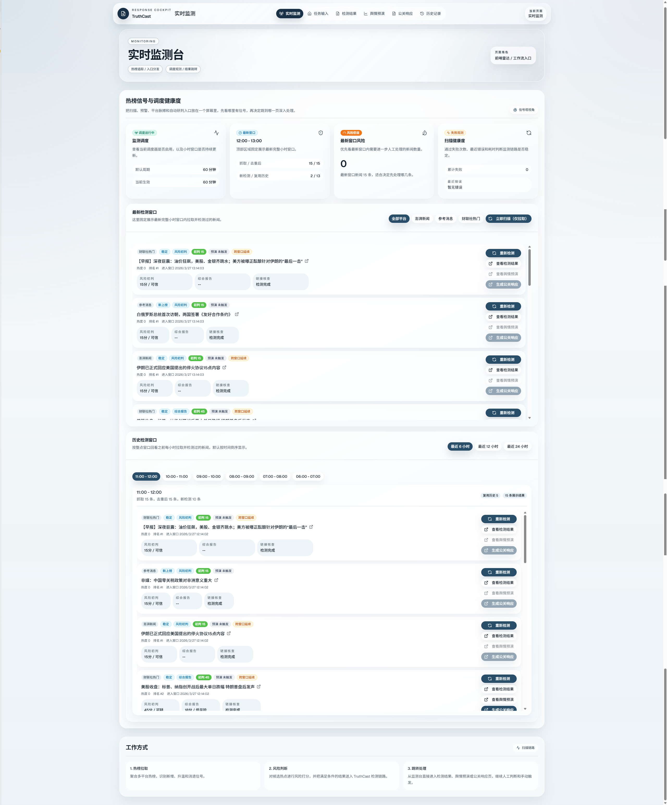
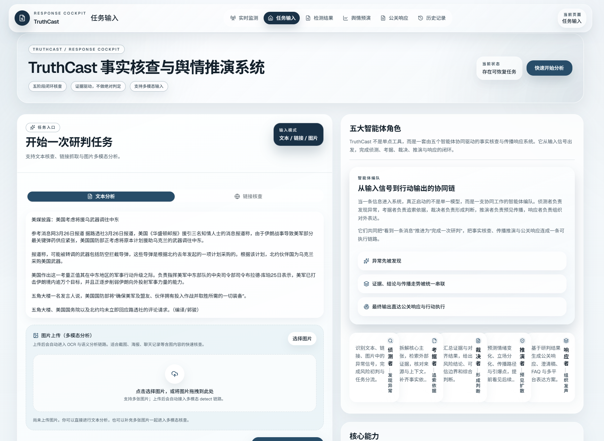
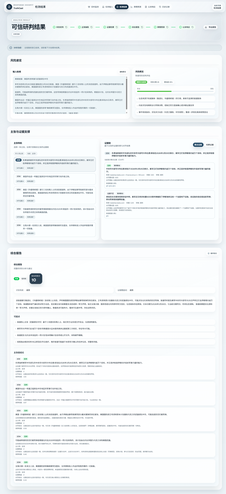
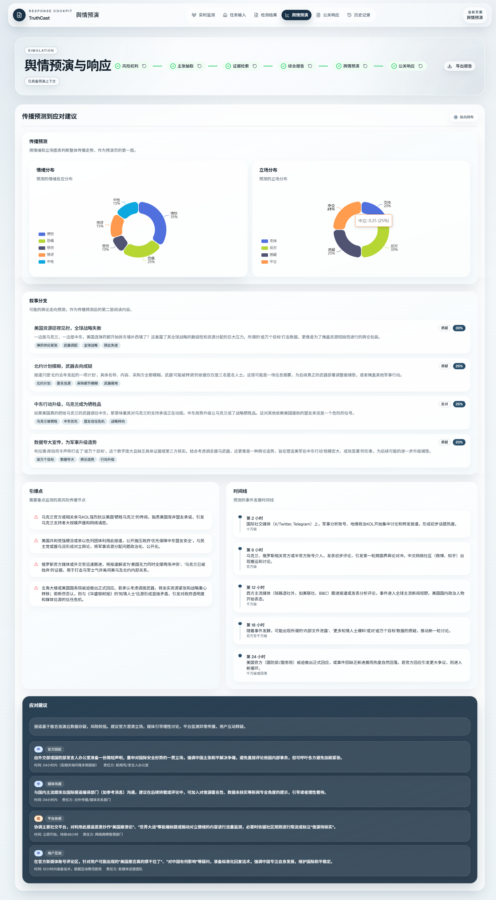
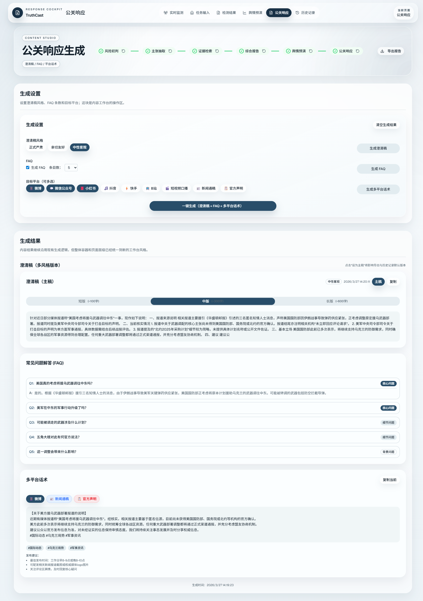
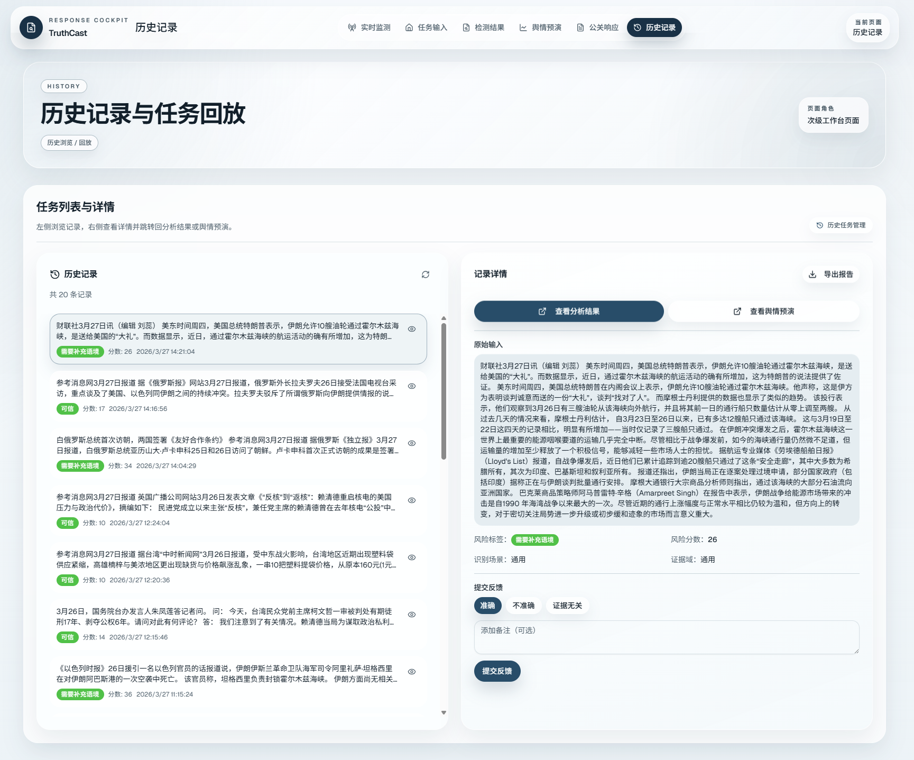

# TruthCast (明察) - 面向事实核查与舆情预演的全链路智能体系统

**TruthCast (明察)** 是一个将**事实核查**、**舆情预演**与**公关响应生成**串成闭环的智能体系统。它基于大语言模型（LLM）与多智能体系统协同工作，把一段待核查文本拆解为可验证主张，完成联网检索、证据聚合与对齐，生成综合研判报告，并进一步预测舆情演化路径与应对策略。

它的重点不是只给出一个“真假判断”，而是把“为什么这样判断”“证据来自哪里”“如果继续传播会怎样”都显式展示出来，并进一步给出了公关响应建议。

## 🌟 核心特性 (Advantage)

- **🤖 Agent 自主策略**:
  - 动态感知文本复杂度以决定主张抽取数量。
  - 基于风险分数动态调整证据检索深度。
  - 由 LLM 自主决定证据聚合粒度，在固定工作流中实现轻量策略选择。
- **🔍 深度事实核查**:
  - **风险初判**: 快速评估文本可信度与潜在风险。
  - **主张抽取**: 将复杂长文本拆解为原子化、可核查的核心主张。
  - **混合检索**: 支持 Bocha（博查）、SearXNG、Tavily、SerpAPI 等多引擎联网检索。
  - **证据聚合与对齐**: LLM 驱动的证据归纳，逐条主张与证据进行立场对齐（支持/反对/证据不足）并给出置信度。
  - **可解释报告**: 输出场景识别、证据覆盖域、对齐理由与最终风险提示，而非仅给单点结论。
- **📈 舆情演化预演**:
  - **四阶段预测**: 情绪与立场分析 → 叙事分支生成 → 引爆点识别 → 应对建议生成。
  - **流式输出**: 支持 SSE (Server-Sent Events) 流式返回预演结果，提升前端响应体验。
  - **结构化建议**: 输出优先级、责任方、时间线与行动项，便于直接展示和落地。
- **📝 公关响应生成**:
  - 支持生成 **澄清稿（短/中/长）**、**FAQ**、以及 **多平台话术**（微博/微信公众号/小红书/抖音/快手/B站/短视频口播/新闻通稿/官方声明）。
  - 与核查结果和舆情预演联动，避免“先生成内容、后寻找依据”。
- **🛡️ 高可用与稳定性**:
  - **规则兜底**: 所有 LLM 节点（抽取、对齐、预演等）均配备规则回退机制，确保在 LLM 失败或超时时系统依然可用。
  - **JSON 自动修复**: 内置 `json-repair` 机制，增强对 LLM 非标准 JSON 输出的解析鲁棒性。
  - **阶段级恢复**: 支持阶段状态持久化、刷新恢复、任务回放与错误重试。
- **💻 现代化控制台**:
  - 基于 Next.js 16 + Tailwind CSS 4 + shadcn/ui 构建的响应式前端。
  - 支持实时进度、历史记录回放、证据视图切换、报告导出、移动端适配。
  - 结果页、预演页、公关响应页均支持导出 JSON/Markdown。

## 🌐 在线体验

- Web 控制台: [http://38.226.195.121:3000/](http://38.226.195.121:3000/)

## 🖼️ 界面截图

### 实时监测页（多来源平台+实时刷新）



### 输入页



### 检测结果页（风险初判 + 主张 + 证据链 + 综合报告）



### 舆情预演页（SSE 流式分阶段展示）



### 公关响应生成页（澄清稿/FAQ/多平台话术）



### 历史记录页（列表/详情/回放/反馈）



## 🛠️ 技术栈

### 后端 (Backend)

- **框架**: Python 3.11+, FastAPI, Pydantic v2
- **AI/LLM**: OpenAI API 兼容接口 (支持 GPT-4o, Claude, DeepSeek, 各种国产大模型等)
- **数据存储**: SQLite (历史记录与反馈持久化)
- **测试**: pytest (全量覆盖率)

### 前端 (Frontend)

- **框架**: Next.js 16 (App Router), React 19
- **样式与 UI**: Tailwind CSS 4, shadcn/ui, Lucide Icons
- **状态管理与请求**: Zustand, SWR, Axios
- **数据可视化**: ECharts (echarts-for-react)

## 📂 项目结构

```
TruthCast/
├── app/                      # 后端服务
│   ├── api/                  # API 路由（detect/simulate/content/history/chat/monitor 等）
│   │   └── chat/             # 对话工作台路由与 SSE 编排
│   ├── cli/                  # Typer 命令行入口与子命令
│   │   ├── commands/
│   │   └── lib/
│   ├── core/                 # 环境加载、认证、限流、并发、日志等基础设施
│   ├── orchestrator/         # Agent 编排引擎与注册容器
│   ├── schemas/              # Pydantic 数据模型
│   ├── services/             # 核心业务逻辑
│   │   ├── content_generation/  # 公关响应生成
│   │   ├── monitor/             # 监测台存储、调度、预警
│   │   ├── multimodal/          # 多模态分析相关服务
│   │   └── url_extraction/      # 链接抓取与正文抽取
│   └── skills/               # Agent 技能
├── config/                   # 配置文件
├── data/                     # 本地运行数据
│   ├── chat/                 # 对话工作台数据库
│   ├── history/              # 历史记录数据库
│   ├── kb/                   # 知识库/证据数据
│   ├── monitor/              # 监测台数据
│   └── uploads/              # 上传文件
├── debug/                    # 各阶段 trace 与调试日志
├── docs/                     # 项目文档与 README 截图资源
│   ├── images/
│   └── superpowers/
├── plans/                    # 规划与方案文件
├── scripts/                  # 辅助脚本
├── tests/                    # 测试文件
├── web/                      # 前端控制台（Next.js）
│   ├── public/               # 静态资源
│   ├── src/
│   │   ├── app/              # 页面路由
│   │   ├── components/       # UI 与业务组件
│   │   ├── hooks/            # 自定义 hooks
│   │   ├── lib/              # 工具函数与 i18n 映射
│   │   ├── services/         # API 服务层
│   │   ├── stores/           # Zustand 状态管理
│   │   └── types/            # TypeScript 类型
│   └── .env.example          # 前端环境变量示例
└── pyproject.toml            # 后端包配置与 CLI 入口
```

## 🚀 部署方案 (Deployment Options)

本项目支持多种部署方式，你可以根据需求选择最适合的方案。

### 方案一：Docker Compose 部署 (推荐)

这是最简单、最稳定的部署方式，适合在服务器或本地快速拉起完整环境。

```bash
# 1. 克隆项目
git clone <repository-url>
cd TruthCast

# 2. 配置环境变量
cp .env.example .env
# 编辑 .env 文件，至少检查安全配置、LLM API Key 和搜索引擎 API Key

# 3. 启动服务 (后台运行)
docker-compose up -d
```

- 访问前端控制台: `http://localhost:3000`
- 访问后端 API 文档: `http://localhost:8000/docs`

部署前建议优先检查以下安全相关环境变量：

- `TRUTHCAST_CORS_ORIGINS`：生产环境务必改成真实前端域名，多个域名用逗号分隔。
- `TRUTHCAST_API_KEY`：留空则关闭 API 认证；生产环境建议设置，并让客户端携带 `Authorization: Bearer <key>` 或 `X-API-Key`。
- `TRUTHCAST_RATE_LIMIT_RPM`：每个 IP 每分钟最大请求数，默认 `60`，设为 `0` 可关闭限流。
- `TRUTHCAST_SSRF_BLOCK_PRIVATE`：默认 `true`，会阻止后端访问内网 / 私网 / 云元数据地址。

> **注意**: 如果你将项目部署在远程服务器上，请在启动前设置 `NEXT_PUBLIC_API_BASE` 环境变量指向服务器的公网 IP 或域名，例如：
> `NEXT_PUBLIC_API_BASE=http://your-server-ip:8000 docker-compose up -d --build`

---

### 方案二：本地开发部署 (Local Development)

适合需要修改代码、进行二次开发的场景。

#### 1. 后端服务 (Backend)

```powershell
# 1. 进入项目根目录
cd TruthCast

# 2. 创建并激活虚拟环境
python -m venv .venv
.\.venv\Scripts\Activate.ps1  # Windows
# source .venv/bin/activate   # Linux/macOS

# 3. 安装依赖
pip install -e .[dev]

# 4. 配置环境变量
copy .env.example .env
# 编辑 .env 文件，至少检查安全配置、LLM API Key 和搜索引擎 API Key

# 5. 启动服务
uvicorn app.main:app --reload --host 0.0.0.0 --port 8000
```

*后端服务将运行在 `http://localhost:8000`。*

本地开发默认兼容旧流程，但有两点需要注意：

- `TRUTHCAST_API_KEY` 默认可留空；留空时后端会自动关闭认证，方便本地联调。
- `TRUTHCAST_CORS_ORIGINS` 默认允许 `http://localhost:3000` 和 `http://127.0.0.1:3000`，因此 README 里的前后端本地启动方式保持可用。

#### 2. 前端控制台 (Frontend)

```powershell
# 1. 进入前端目录
cd web

# 2. 安装依赖
npm install

# 3. 配置环境变量
copy .env.example .env.local
# 确保 .env.local 中 NEXT_PUBLIC_API_BASE 指向后端地址（默认 http://127.0.0.1:8000）

# 4. 启动开发服务器
npm run dev
```

*前端控制台将运行在 `http://localhost:3000`。*

#### 3. 对话工作台 (Chat Workbench)

前端提供统一的对话入口：`http://localhost:3000/chat`。

后端对话相关接口：

- 兼容入口（保持可用）：`POST /chat/stream`
- 会话化入口（推荐）：
  - `POST /chat/sessions` 创建会话
  - `POST /chat/sessions/{session_id}/messages/stream` 发送消息并以 SSE 流式返回

常用命令：

- `/analyze <待分析文本>`：触发一次全链路分析（风险初判→主张→证据→对齐→报告），并写入历史记录。
- `/load_history <record_id>`：把历史记录加载到前端上下文（然后可打开 `/result` 查看模块化结果）。

会话 DB 默认写入 `data/chat/chat.db`，可通过环境变量覆盖：

```ini
TRUTHCAST_CHAT_DB_PATH=data/chat/chat.db
```

---

## ⚙️ 核心配置说明

项目通过根目录的 `.env` 文件进行全局配置。系统支持高度定制化，你可以通过开关控制各个模块是使用 LLM 还是回退到规则引擎。

### 1. 安全配置（部署后建议首先检查）

```ini
# CORS 白名单（逗号分隔）
TRUTHCAST_CORS_ORIGINS=http://localhost:3000,http://127.0.0.1:3000

# API Key 认证；留空则关闭认证
TRUTHCAST_API_KEY=

# 每分钟每 IP 最大请求数；0 = 不限流
TRUTHCAST_RATE_LIMIT_RPM=60

# SSRF 防护：阻止访问私有 / 内部 IP 和云元数据端点
TRUTHCAST_SSRF_BLOCK_PRIVATE=true
```

说明：

- 设置了 `TRUTHCAST_API_KEY` 后，除 `/health`、`/docs`、`/redoc`、`/openapi.json` 外，其余接口都需要认证。
- 认证支持 `Authorization: Bearer <key>` 和 `X-API-Key: <key>` 两种方式。
- 限流命中时后端会返回 `429` 并附带 `Retry-After`；未命中限流的正常响应会附带 `X-RateLimit-Limit`、`X-RateLimit-Remaining` 响应头。
- SSRF 防护会影响用户输入 URL 的抓取类能力；如确需抓取内网地址，只建议在受信任的内网环境下临时关闭。

### 2. 基础与全局 LLM 配置

以下配置是多数模块的公共基础。若模块级模型未单独指定，默认回退到这里的全局配置。

```ini
# 基础配置
APP_NAME=TruthCast MVP
APP_ENV=dev
LOG_LEVEL=INFO

# 前端访问后端的基础地址
NEXT_PUBLIC_API_BASE=http://127.0.0.1:8000

# 全局 LLM 开关与默认配置
TRUTHCAST_LLM_ENABLED=false
TRUTHCAST_LLM_BASE_URL=https://api.openai.com/v1
TRUTHCAST_LLM_MODEL=gpt-4o-mini
TRUTHCAST_LLM_API_KEY=
TRUTHCAST_LLM_TIMEOUT=60
TRUTHCAST_DEBUG_LLM=true

# 持久化与输入限制
TRUTHCAST_HISTORY_DB_PATH=
TRUTHCAST_MAX_INPUT_CHARS=8000
```

### 3. 主张抽取、风险快照与复杂度分析

这组配置决定了系统如何拆解文本、是否启用 LLM 辅助，以及如何控制主张规模。

```ini
# Claim 抽取
TRUTHCAST_CLAIM_METHOD=claimify
TRUTHCAST_EXTRACTION_LLM_MODEL=
TRUTHCAST_CLAIM_MAX_ITEMS=8
TRUTHCAST_CLAIM_MIN_SCORE=0.25

# 风险快照
TRUTHCAST_RISK_LLM_ENABLED=false
TRUTHCAST_RISK_LLM_MODEL=
TRUTHCAST_DEBUG_RISK_SNAPSHOT=true

# 文本复杂度分析
TRUTHCAST_COMPLEXITY_LLM_ENABLED=false
TRUTHCAST_COMPLEXITY_LLM_MODEL=
TRUTHCAST_DEBUG_COMPLEXITY=false
```

说明：

- `TRUTHCAST_CLAIM_METHOD` 决定主张抽取策略，默认值为 `claimify`。
- `TRUTHCAST_CLAIM_MAX_ITEMS` 与 `TRUTHCAST_CLAIM_MIN_SCORE` 用于控制输出数量和质量门槛。
- 风险快照与复杂度分析都支持独立 LLM 开关，关闭时自动回退到规则路径。

### 4. 联网检索、证据摘要与证据对齐

这一组配置决定了系统如何检索外部证据，以及如何做证据压缩与对齐。

```ini
# 联网检索总开关
TRUTHCAST_WEB_RETRIEVAL_ENABLED=true
TRUTHCAST_WEB_RETRIEVAL_TOPK=10
TRUTHCAST_WEB_RETRIEVAL_TIMEOUT_SEC=8
TRUTHCAST_DEBUG_WEB_RETRIEVAL=true

# 搜索 Provider 选择: baidu | bocha | searxng | tavily | serpapi
TRUTHCAST_WEB_SEARCH_PROVIDER=bocha
TRUTHCAST_WEB_ALLOWED_DOMAINS=

# 博查（推荐国内使用）
TRUTHCAST_BOCHA_API_KEY=
TRUTHCAST_BOCHA_ENDPOINT=https://api.bochaai.com/v1/web-search
TRUTHCAST_BOCHA_FRESHNESS=oneYear
TRUTHCAST_BOCHA_SUMMARY=true

# SearXNG
TRUTHCAST_SEARXNG_ENDPOINT=https://searx.be/search
TRUTHCAST_SEARXNG_ENGINES=google,bing,duckduckgo
TRUTHCAST_SEARXNG_CATEGORIES=
TRUTHCAST_SEARXNG_LANGUAGE=zh-CN

# 百度
TRUTHCAST_BAIDU_API_KEY=
TRUTHCAST_BAIDU_ENDPOINT=https://api.qnaigc.com/v1/search/web
TRUTHCAST_BAIDU_TIME_FILTER=year
TRUTHCAST_BAIDU_SITE_FILTER=

# Tavily / SerpAPI
TRUTHCAST_TAVILY_API_KEY=
TRUTHCAST_TAVILY_ENDPOINT=https://api.tavily.com/search
TRUTHCAST_SERPAPI_API_KEY=
TRUTHCAST_SERPAPI_ENDPOINT=https://serpapi.com/search.json

# 证据摘要
TRUTHCAST_EVIDENCE_SUMMARY_ENABLED=false
TRUTHCAST_EVIDENCE_SUMMARY_MAX_ITEMS=3
TRUTHCAST_EVIDENCE_SUMMARY_INPUT_LIMIT=10
TRUTHCAST_EVIDENCE_SUMMARY_LLM_MODEL=
TRUTHCAST_DEBUG_EVIDENCE_SUMMARY=true

# 证据对齐
TRUTHCAST_ALIGNMENT_LLM_ENABLED=false
TRUTHCAST_ALIGNMENT_LLM_MODEL=
TRUTHCAST_DEBUG_ALIGNMENT=true
```

说明：

- `TRUTHCAST_WEB_RETRIEVAL_ENABLED` 控制是否启用联网检索。
- `TRUTHCAST_WEB_RETRIEVAL_TOPK` 是每条主张的最大检索数量。
- `TRUTHCAST_WEB_ALLOWED_DOMAINS` 可用于生产环境限制来源域名。
- 证据摘要层默认可关闭，适合先做原始证据链调试，再逐步打开聚合层。

### 5. 报告生成、舆情预演与应对内容生成

这组配置负责分析后半段的“综合研判”和“响应输出”。

```ini
# 综合报告
TRUTHCAST_REPORT_LLM_ENABLED=false
TRUTHCAST_REPORT_LLM_MODEL=
TRUTHCAST_REPORT_TIMEOUT_SEC=30
TRUTHCAST_REPORT_TZ=Asia/Hong_Kong
TRUTHCAST_CLAIM_RANK_ALPHA=0.25
TRUTHCAST_REPORT_TOPK=0
TRUTHCAST_REPORT_NON_TOPK_FACTOR=0.5
TRUTHCAST_REPORT_SCORE_BREAKDOWN_ENABLED=
TRUTHCAST_DEBUG_REPORT=true

# 舆情预演
TRUTHCAST_SIMULATION_LLM_ENABLED=false
TRUTHCAST_SIMULATION_LLM_MODEL=gpt-4o-mini
TRUTHCAST_SIMULATION_MAX_NARRATIVES=4
TRUTHCAST_SIMULATION_TIMEOUT_SEC=45
TRUTHCAST_SIMULATION_MAX_RETRIES=2
TRUTHCAST_SIMULATION_RETRY_DELAY=2
TRUTHCAST_DEBUG_SIMULATION=true

# 公关响应生成
TRUTHCAST_CONTENT_LLM_ENABLED=false
TRUTHCAST_CONTENT_LLM_MODEL=
TRUTHCAST_CONTENT_LLM_BASE_URL=
TRUTHCAST_CONTENT_LLM_API_KEY=
TRUTHCAST_CONTENT_TIMEOUT_SEC=45
TRUTHCAST_DEBUG_CONTENT=true

# 澄清稿 / FAQ / 平台话术
TRUTHCAST_CLARIFICATION_SHORT_MAX=150
TRUTHCAST_CLARIFICATION_MEDIUM_MAX=400
TRUTHCAST_CLARIFICATION_LONG_MAX=800
TRUTHCAST_FAQ_DEFAULT_COUNT=5
TRUTHCAST_FAQ_MAX_COUNT=10
TRUTHCAST_PLATFORM_WEIBO_MAX=280
TRUTHCAST_PLATFORM_WECHAT_MAX=1000
```

说明：

- 报告生成支持独立 LLM 开关，也支持纯规则/加权路径。
- `TRUTHCAST_REPORT_TZ` 用于时间语境判断，避免“昨天/明天”这类表达出现时区错位。
- 应对内容生成可使用独立模型配置，也可回退到全局 LLM。

### 6. 并发、缓存与 URL 抽取配置

这部分更偏工程运行参数，建议在联调或部署阶段再调。

```ini
# 并发控制
TRUTHCAST_CLAIM_PARALLEL_WORKERS=3
TRUTHCAST_ALIGN_PARALLEL_WORKERS=4
TRUTHCAST_LLM_CONCURRENCY=5
TRUTHCAST_MAX_QUEUE_WAIT_SEC=30

# 内存缓存
TRUTHCAST_CACHE_DETECT_TTL=300
TRUTHCAST_CACHE_CLAIMS_TTL=300
TRUTHCAST_CACHE_MAX_SIZE=100

# URL 抽取
TRUTHCAST_URL_EXTRACT_ENABLED=true
TRUTHCAST_URL_EXTRACT_PRIMARY=readability
TRUTHCAST_URL_EXTRACT_SECONDARY=trafilatura
TRUTHCAST_URL_EXTRACT_RENDER_FALLBACK=true
TRUTHCAST_URL_EXTRACT_MIN_CONTENT_LEN=150
TRUTHCAST_URL_EXTRACT_MIN_PARAGRAPHS=2
TRUTHCAST_URL_EXTRACT_DEBUG=true
TRUTHCAST_URL_RENDER_TIMEOUT_SEC=20
TRUTHCAST_URL_RENDER_WAIT_UNTIL=networkidle
TRUTHCAST_URL_EXTRACT_LLM_ENABLED=false
TRUTHCAST_URL_EXTRACT_LLM_MODE=postprocess
TRUTHCAST_URL_EXTRACT_LLM_MODEL=
TRUTHCAST_URL_EXTRACT_LLM_TIMEOUT_SEC=20
TRUTHCAST_URL_COMMENT_ENABLED=true
TRUTHCAST_URL_COMMENT_MAX_ITEMS=100
```

### 7. 其他运行配置

以下配置不一定是首次启动必填，但它们已经被当前代码实际使用：

```ini
# 对话工作台 / CLI
TRUTHCAST_CHAT_DB_PATH=data/chat/chat.db
TRUTHCAST_API_BASE=http://127.0.0.1:8000
TRUTHCAST_CLI_TIMEOUT=30

# 实时监测台
TRUTHCAST_MONITOR_ENABLED=false
TRUTHCAST_MONITOR_DB_PATH=
TRUTHCAST_MONITOR_SCAN_INTERVAL_MINUTES=10
TRUTHCAST_MONITOR_MANUAL_SCAN_AUTO_ANALYZE=false

# 多模态 / OCR / 视觉分析
TRUTHCAST_IMAGE_STORAGE_PATH=data/uploads
TRUTHCAST_OCR_PROVIDER=vision_llm
TRUTHCAST_VISION_PROVIDER=vision_llm
```

### 8. 配置建议

- **本地演示最小配置**：优先填写 `TRUTHCAST_LLM_API_KEY`、`TRUTHCAST_LLM_BASE_URL`、`TRUTHCAST_LLM_MODEL`、`TRUTHCAST_WEB_SEARCH_PROVIDER` 以及对应搜索 API Key。
- **先调通，再加开关**：建议先用最小配置跑通链路，再逐步打开风险快照、证据摘要、报告生成等 LLM 模块。
- **以 `.env.example` 为准**：README 只保留高频配置说明，完整字段请直接查看根目录 [`.env.example`](/home/eryndor/code/TruthCast/.env.example)。

## 🔌 API 端点概览

> 若已设置 `TRUTHCAST_API_KEY`，除 `/health`、`/docs`、`/redoc`、`/openapi.json` 外，其余接口均需携带 API Key。

### 基础与事实核查

| 端点 | 方法 | 描述 |
| ---- | ---- | ---- |
| `/health` | GET | 服务健康检查 |
| `/detect` | POST | 风险初判（快速评估文本风险） |
| `/detect/claims` | POST | 主张抽取（提取核心事实陈述） |
| `/detect/evidence` | POST | 证据检索（联网搜索相关证据） |
| `/detect/evidence/align` | POST | 证据聚合与对齐 |
| `/detect/report` | POST | 综合报告（生成最终核查结论并落库） |
| `/detect/url` | POST | 抓取新闻链接并执行初始核查 |
| `/detect/url/crawl` | POST | 仅抓取链接正文与元信息 |
| `/detect/url/risk` | POST | 对已抓取正文执行风险快照 |

### 舆情预演与应对内容

| 端点 | 方法 | 描述 |
| ---- | ---- | ---- |
| `/simulate` | POST | 舆情预演（生成四阶段演化预测） |
| `/simulate/stream` | POST | 舆情预演 SSE 流式返回 |
| `/content/generate` | POST | 一键生成公关响应（澄清稿 + FAQ + 多平台话术） |
| `/content/clarification` | POST | 单独生成澄清稿 |
| `/content/faq` | POST | 单独生成 FAQ |
| `/content/platform-scripts` | POST | 单独生成多平台话术 |
| `/export/pdf` | POST | 导出 PDF 报告 |
| `/export/word` | POST | 导出 Word 报告 |

### 历史记录与阶段状态

| 端点 | 方法 | 描述 |
| ---- | ---- | ---- |
| `/history` | GET | 获取历史分析记录列表 |
| `/history/{record_id}` | GET | 获取单条历史记录详情（支持回放） |
| `/history/{record_id}/feedback` | POST | 提交人工反馈（准确/不准确） |
| `/history/{record_id}/simulation` | POST | 写回/更新舆情预演结果 |
| `/history/{record_id}/content` | POST | 写回/更新公关响应草稿 |
| `/pipeline/save-phase` | POST | 保存某阶段快照与状态 |
| `/pipeline/load-latest` | GET | 读取最近一次任务状态或指定任务状态 |

### 对话工作台

| 端点 | 方法 | 描述 |
| ---- | ---- | ---- |
| `/chat` | POST | 非流式对话编排入口 |
| `/chat/stream` | POST | SSE 流式对话入口（V1，兼容路径） |
| `/chat/sessions` | POST | 创建会话 |
| `/chat/sessions` | GET | 获取会话列表 |
| `/chat/sessions/{session_id}` | GET | 获取单个会话详情 |
| `/chat/sessions/{session_id}/messages/stream` | POST | 会话化 SSE 流式消息入口（V2，推荐） |

### 多模态

| 端点 | 方法 | 描述 |
| ---- | ---- | ---- |
| `/multimodal/upload` | POST | 上传图片素材 |
| `/multimodal/files/{file_id}` | GET | 获取已上传图片文件 |
| `/multimodal/files/{file_id}` | DELETE | 删除已上传图片文件 |
| `/multimodal/detect` | POST | 文本 + 图片联合分析 |
| `/multimodal/analyze-images` | POST | 仅执行图片分支分析 |

### 实时监测台

| 端点 | 方法 | 描述 |
| ---- | ---- | ---- |
| `/monitor/subscriptions` | GET | 获取订阅列表 |
| `/monitor/subscriptions` | POST | 创建订阅 |
| `/monitor/subscriptions/{sub_id}` | GET | 获取订阅详情 |
| `/monitor/subscriptions/{sub_id}` | PATCH | 更新订阅 |
| `/monitor/subscriptions/{sub_id}` | DELETE | 删除订阅 |
| `/monitor/hot-items` | GET | 获取热榜/热点条目 |
| `/monitor/scan` | POST | 触发手动扫描 |
| `/monitor/alerts` | GET | 获取预警列表 |
| `/monitor/alerts/{alert_id}` | GET | 获取单条预警 |
| `/monitor/alerts/{alert_id}/ack` | POST | 确认预警 |
| `/monitor/hot-items/{item_id}/assess` | POST | 对单条热点执行风险评估 |
| `/monitor/status` | GET | 获取监测调度运行状态 |
| `/monitor/analysis-results` | GET | 获取监测分析结果列表 |
| `/monitor/analysis-results/{result_id}` | GET | 获取单条监测分析结果 |
| `/monitor/window-items/{item_id}/analyze` | POST | 对窗口条目执行完整分析 |
| `/monitor/analysis-results/{result_id}/generate-content` | POST | 基于监测结果生成公关响应 |
| `/monitor/windows/latest` | GET | 获取最新监测窗口详情 |
| `/monitor/windows/history` | GET | 获取历史监测窗口列表 |

## 🔄 工作流程 (Workflow)

TruthCast 当前已经不只是单一路径的“文本检测器”，而是支持多种入口汇入同一套研判链路。

### 1. 标准文本核查主链路

这是系统最核心、最完整的工作流，也是前端首页和 CLI 默认走的路径。

```text
输入文本
  ↓
风险初判
  ↓
主张抽取
  ↓
联网检索
  ↓
证据聚合
  ↓
证据对齐
  ↓
综合报告
  ↓
舆情预演
  ↓
公关响应生成
```

对应说明：

1. **输入阶段**：用户输入待核查文本，例如新闻报道、社交媒体传言、公告摘录等。
2. **风险初判**：系统先给出一个初始风险分数、风险标签与原因摘要。
3. **主张抽取**：根据文本复杂度自动决定抽取规模，将长文本拆成 1-N 条可核查主张。
4. **联网检索**：根据风险分数调整检索深度，对每条主张调用搜索引擎获取候选证据。
5. **证据聚合**：对多条检索结果进行压缩、去重与摘要，降低后续对齐成本。
6. **证据对齐**：判断证据与主张之间的关系是支持、反对还是证据不足，并产出理由与置信度。
7. **综合报告**：汇总所有主张的对齐结果，生成风险结论、场景识别、证据覆盖域与综合摘要。
8. **舆情预演**：基于报告继续预测情绪演化、叙事分支、引爆点与应对建议。
9. **公关响应生成**：基于报告与预演结果生成澄清稿、FAQ 与多平台话术。

### 2. 链接核查分支

当输入是一条新闻链接而不是纯文本时，系统会先做正文抽取，再接入主链路。

```text
输入 URL
  ↓
正文抓取 / 发布时间提取 / 评论抓取
  ↓
风险初判
  ↓
后续进入标准文本核查主链路
```

这一分支适合新闻网页、媒体文章、转载链接等场景。系统支持只抓取正文，也支持抓取后直接做风险快照与后续分析。

### 3. 多模态分析分支

当前系统支持“文本 + 图片”联合分析。图片会先经过 OCR 与图像语义分析，再与文本主链路结果融合。

```text
输入文本 + 图片
  ↓
文本主链路
  ↓
图片 OCR / 图像语义分析
  ↓
多模态融合报告
  ↓
回写到综合报告上下文
```

这一分支适合截图谣言、图文混合新闻、海报式传播内容等场景。若图片分支识别出语义冲突，融合层会提升风险并输出冲突点。

### 4. 实时监测台工作流

监测台不是手工单次分析，而是“采集 - 筛选 - 分析 - 回写”的持续化流程。

```text
平台订阅 / 手动扫描
  ↓
热榜抓取与窗口落库
  ↓
风险阈值筛选
  ↓
自动执行抓取、主张、证据、报告、预演
  ↓
写入监测结果与历史记录
  ↓
必要时生成公关响应
```

对应说明：

1. **采集阶段**：按订阅平台或手动扫描任务拉取热点条目。
2. **窗口化存储**：先写入监测窗口，再异步回填检测状态与分析结果。
3. **阈值筛选**：仅对风险达到阈值的条目继续执行深度分析。
4. **自动分析**：进入与主链路一致的抓取、风险、主张、证据、报告、预演流程。
5. **结果回写**：分析结果同步写入监测台与历史记录，并通过 `history_record_id` 关联。
6. **后续处置**：当预演完成后，可继续触发公关响应生成。

### 5. 对话工作台闭环

对话工作台并不是独立于主系统的另一套逻辑，而是对主链路能力的会话化封装。

```text
用户自然语言提问
  ↓
意图识别 / 技能路由
  ↓
调用主链路某一阶段或完整链路
  ↓
返回结构化消息、引用卡片、操作建议
  ↓
继续追问 / 重写 / 补充证据
```

这使系统既能以控制台方式演示，也能以 Copilot 式工作台方式演示，适合答辩时展示“同一后端能力的多入口复用”。

## 🖥️ CLI 命令行工具

除了 Web 控制台，TruthCast 还提供了一个功能强大的命令行界面（CLI），方便在终端进行快速分析或自动化集成。

### 1. 安装与配置

CLI 工具已集成在后端包中。确保你已经按照“本地开发部署”步骤安装了依赖：

```bash
pip install -e .
```

### 2. 核心命令

你可以使用 `truthcast` 命令调用各种功能：

- **全链路分析**:

  ```bash
  truthcast analyze
  # 然后粘贴待分析文本，Ctrl+D 结束输入（推荐，避免被当作文件路径）
  ```

- **交互式对话 (REPL)**:

  ```bash
  truthcast chat
  ```

- **查看历史**:

  ```bash
  truthcast history list
  ```

### 3. Agent 模式（默认）与 `--no-agent`

`truthcast chat` 默认是 **Agent 模式**：

- 纯文本会直接交给后端意图路由（不再强制本地包装 `/analyze`）
- 支持在对话中自然触发单技能工具（如 claims-only / evidence-only / report-only / simulate / content，对外展示为“公关响应”）

示例：

```bash
truthcast chat
# 然后输入：
# 只提取主张：网传明天全市停课，官方暂未发布通知。
```

如果你希望回退到旧的确定性路径（纯文本自动包装为 `/analyze <文本>`），可使用：

```bash
truthcast chat --no-agent
```

### 4. 本地 Agent 模式 (`--local-agent`)

`--local-agent` 语义为：**优先使用本地 LLM Agent**，不可用时自动回退到后端编排模式。

```bash
truthcast --local-agent chat
```

说明：

- 本地 Agent 需要配置 `TRUTHCAST_LLM_API_KEY`（以及可选 `TRUTHCAST_LLM_BASE_URL` / `TRUTHCAST_LLM_MODEL`）
- 若未配置 key，CLI 会给出明确提示并自动回退，不会直接崩溃

### 5. 单技能调用示例（Chat）

在 `truthcast chat` 内可直接调用：

```bash
/claims_only 这里是待分析文本
/evidence_only 这里是待分析文本
/align_only
/report_only
/simulate
/content_generate style=friendly
```

### 6. Windows GBK 终端注意事项

- 推荐在 Windows 终端执行：

  ```bat
  chcp 936
  ```

- TruthCast CLI 已做 GBK/cp936 编码降级处理；若 emoji 无法显示，会自动回退为 ASCII 标签（如 `[ERROR]`）
- `truthcast analyze` 建议走 stdin 输入（见上文），避免把中文参数误判为文件路径

### 7. 环境变量

CLI 同样依赖根目录下的 `.env` 文件进行 LLM 和搜索引擎配置。

## 🧪 运行测试

项目包含完整的单元测试与集成测试，覆盖率高。

```powershell
# 在项目根目录下运行
.\.venv\Scripts\python.exe -m pytest -v
```

## 📝 更新日志 (Changelog)

### v1.2.0 (2026-03-22) - 📡 实时监测功能上线

- **实时监测台**: 新增监测工作台，支持最新检测窗口、历史检测窗口、平台筛选、手动扫描与窗口化新闻流展示。
- **自动调度与去重**: 支持按平台配置自动扫描 NewsNow 新闻源，按时间窗口落库，并基于 `dedupe_key` 实现跨窗口去重与结果复用。
- **监测分析闭环**: 监测新闻可自动或手动进入链接核查、风险初判、综合报告、舆情预演链路，并支持手动生成公关响应。
- **历史与联动增强**: 监测核查结果已接入历史记录，可从监测台直接跳转到检测结果、舆情预演与公关响应页面继续处理。

### v1.1.0 (2026-02-22) - 🧩 内容闭环与联动增强

- **公关响应生成**: 新增澄清稿（短/中/长）、FAQ、多平台话术生成，并支持多风格多版本与“主稿”机制。
- **导出体验增强**: 结果页/舆情预演页/公关响应页均支持导出报告（JSON/Markdown），Markdown 中“公关响应”章节位于“舆情预演-应对建议”之后。
- **历史回放增强**: 历史记录支持写回/恢复公关响应草稿（`/history/{id}/content`），并支持更新舆情预演结果（`/history/{id}/simulation`）。
- **一致性与容错**: 公关响应页布局与进度时间线交互与其他页面对齐；修复“生成时间 Invalid Date”显示问题。

### v1.0.0 (2026-02-22) - 🚀 核心版本发布

- **全链路闭查**: 风险初判 → 主张抽取 → 混合检索 → 证据聚合 → 证据对齐 → 综合报告 → 舆情预演。
- **Agent 自主策略**: 文本复杂度驱动主张数量，风险分数驱动证据检索深度，LLM 自主决定证据聚合策略。
- **现代化前端控制台**: 基于 Next.js 16 + Tailwind CSS 4 + shadcn/ui 构建，支持实时进度、历史记录回放、证据视图切换与报告导出。
- **多引擎混合检索**: 接入 Bocha（博查）、SearXNG、Tavily、SerpAPI 等多款搜索引擎。
- **高可用架构**: 所有 LLM 节点均配备规则回退机制，内置 `json-repair` 增强解析鲁棒性。
- **流式响应**: 舆情预演支持 SSE 流式输出，大幅提升前端响应体验。

## 📄 License

[MIT License](LICENSE)
